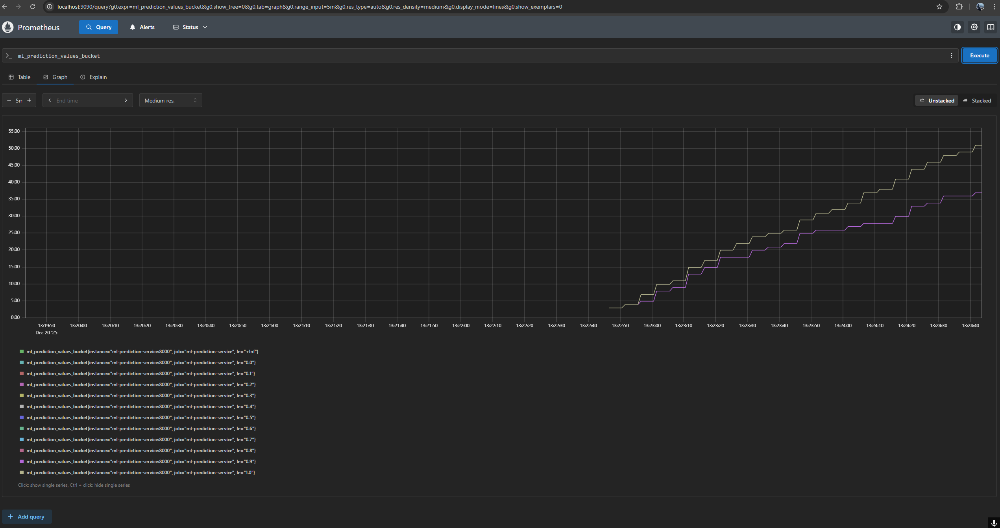
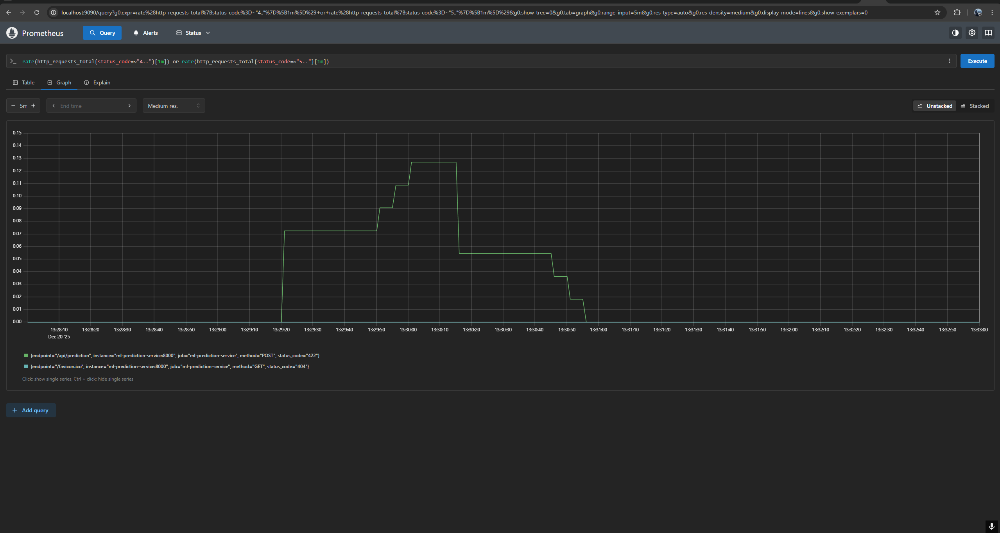
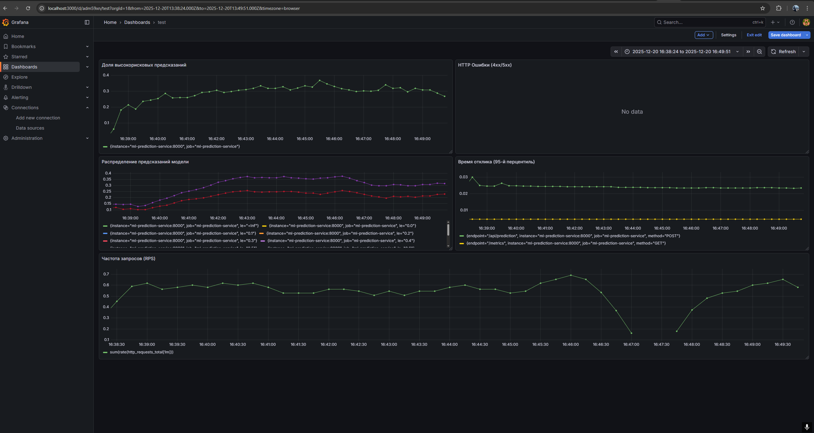

# Heart Disease Prediction ML Service

## Описание проекта

Комплексный проект по разработке системы прогнозирования заболеваний сердца, включающий полный цикл разработки ML-решения: от анализа данных до развертывания микросервиса с мониторингом.

### Использованные технологии:

**Анализ данных и машинное обучение:**
- Python 3.11
- Pandas, NumPy - обработка данных
- Scikit-learn - машинное обучение
- Matplotlib, Seaborn, Plotly - визуализация
- MLflow - управление экспериментами и моделями
- Jupyter Notebook - исследовательский анализ

**Микросервисная архитектура:**
- FastAPI - REST API сервис
- Docker - контейнеризация
- Docker Compose - оркестрация сервисов
- Uvicorn - ASGI сервер

**Мониторинг и метрики:**
- Prometheus - сбор метрик
- Grafana - дашборды и визуализация
- prometheus-client - экспорт метрик из Python

**Инфраструктура:**
- Git/GitHub - система контроля версий
- Linux/Windows - кроссплатформенная разработка

---

## Запуск проекта

### Полный запуск через Docker Compose:

```bash
cd services
docker-compose up --build
```

### Доступные сервисы:

- **ML API**: http://localhost:8000 (Swagger UI: http://localhost:8000/docs)
- **Prometheus**: http://localhost:9090
- **Grafana**: http://localhost:3000 (admin:admin)

### Альтернативный запуск (по частям):

1. **Активация виртуального окружения:**
   ```bash
   source .venv_my_proj/bin/activate  # Linux/Mac
   # или
   .venv_my_proj\Scripts\activate     # Windows
   ```

2. **Установка зависимостей:**
   ```bash
   pip install -r requirements.txt
   ```

3. **Запуск MLflow:**
   ```bash
   cd eda/mlflow
   sh start_mlflow.sh
   ```

---

## Сервисы и компоненты

### ML Service (FastAPI)
**Директория:** `services/ml_service/`

**Файлы:**
- `main.py` - FastAPI приложение с эндпоинтами и метриками Prometheus
- `api_handler.py` - класс для загрузки модели и выполнения предсказаний
- `Dockerfile` - конфигурация сборки образа
- `requirements.txt` - Python зависимости

**Эндпоинты:**
- `GET /` - проверка работоспособности
- `POST /api/prediction` - получение предсказаний
- `GET /metrics` - метрики Prometheus

### Prometheus
**Директория:** `services/prometheus/`

**Файлы:**
- `prometheus.yml` - конфигурация сбора метрик
- `data/` - хранилище метрик

**Веб-интерфейс:** http://localhost:9090

### Grafana
**Директория:** `services/grafana/`

**Файлы:**
- `datasources/` - автоматическое подключение к Prometheus
- `dashboards/` - экспортированные дашборды
- `data/` - настройки и данные Grafana

**Веб-интерфейс:** http://localhost:3000

### Requests Service
**Директория:** `services/requests/`

**Файлы:**
- `requests.py` - генератор тестовых запросов к ML API
- `requirements.txt` - зависимости для HTTP клиента
- `Dockerfile` - контейнеризация сервиса тестирования

---

## Мониторинг

### Графики в Prometheus:

1. **Гистограмма предсказаний модели:**
   ```
   ml_prediction_values_bucket
   ```
   
   Показывает распределение значений предсказаний ML модели

2. **Частота запросов в минуту:**
   ```
   rate(http_requests_total[1m])
   ```
   .png)
   Метрика нагрузки на сервис

3. **Ошибки 4xx и 5xx:**
   ```
   rate(http_requests_total{status_code=~"4.."}[1m])
   rate(http_requests_total{status_code=~"5.."}[1m])
   ```
   

   Мониторинг ошибок клиента и сервера

---

## Дашборд Grafana



### Описание графиков:

1. **Частота запросов (RPS)** - *Инфраструктурный уровень*
   - Отображает количество запросов в секунду к ML сервису
   - Помогает отслеживать нагрузку на систему

2. **Время отклика (95-й перцентиль)** - *Инфраструктурный уровень*
   - 95-й перцентиль времени ответа сервиса
   - Критично для пользовательского опыта

3. **HTTP Ошибки (4xx/5xx)** - *Инфраструктурный уровень*
   - Количество ошибок клиента и сервера в секунду
   - Индикатор проблем в работе сервиса

4. **Распределение предсказаний модели** - *Качество модели*
   - Гистограмма значений предсказаний модели
   - Помогает выявить data drift и аномалии в работе модели

5. **Доля высокорисковых предсказаний** - *Прикладной уровень*
   - Процент предсказаний с высоким риском заболевания (>0.7)
   - Бизнес-метрика для оценки эффективности модели

---

## Результаты анализа данных

### Распределение целевой переменной
Целевая переменная сбалансирована — данные подходят для моделирования без дополнительного балансирования.

### Распределение числовых признаков
- Возраст распределён близко к нормальному
- Холестерин и некоторые другие показатели имеют смещение и выбросы

### Корреляция признаков
- Сильной мультиколлинеарности нет
- Есть умеренные связи (например, давление и возраст)

### Boxplot возраста по целевой переменной
Пациенты с болезнью сердца в среднем младше

### Интерактивный график (возраст vs холестерин)
- Повышенный холестерин чаще встречается у пациентов среднего и старшего возраста
- У таких пациентов выше вероятность наличия болезни сердца

---

## Результаты машинного обучения

### Лучший результат
**Модель:** RandomForest с настройкой гиперпараметров и отбором признаков  
**Метрика:** F1-score = 0.8536 (CV)

**Параметры модели:**
- n_estimators: 200
- max_features: 0.1
- max_depth: 15
- random_state: 42

### Production модель
- **Run ID:** 128bd4a48b8e4f38a8a1c186094d85bf
- Обучена на полной выборке (train + test)
- Зарегистрирована в MLflow Model Registry с тегом "Production"

---

## API Документация

### Пример запроса для предсказания:

**POST** `http://localhost:8000/api/prediction?item_id=123`

**Тело запроса:**
```json
{
  "age": 63,
  "sex": 1,
  "cp": 3,
  "trestbps": 145,
  "chol": 233,
  "fbs": 1,
  "restecg": 0,
  "thalach": 150,
  "exang": 0,
  "oldpeak": 2.3,
  "slope": 0,
  "ca": 0,
  "thal": 1
}
```

**Ответ:**
```json
{
  "item_id": 123,
  "predict": 0.7637315626006276
}
```

### Описание признаков:
- `age` - возраст пациента
- `sex` - пол (1 = мужской, 0 = женский)  
- `cp` - тип боли в груди (0-3)
- `trestbps` - артериальное давление в покое
- `chol` - уровень холестерина
- `fbs` - сахар в крови натощак > 120 мг/дл (1 = да, 0 = нет)
- `restecg` - результаты ЭКГ в покое (0-2)
- `thalach` - максимальная частота сердечных сокращений  
- `exang` - стенокардия, вызванная физической нагрузкой (1 = да, 0 = нет)
- `oldpeak` - депрессия ST, вызванная физической нагрузкой
- `slope` - наклон пикового сегмента ST (0-2)
- `ca` - количество основных сосудов (0-3)
- `thal` - дефект таллия (0-3)

---
